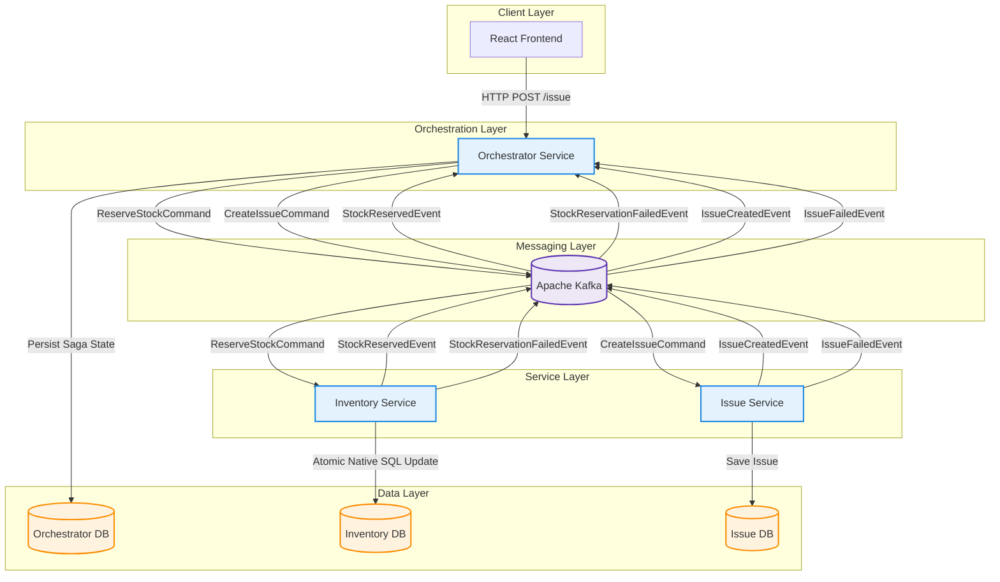

## Failure Scenarios: Broker Down (Service → Kafka)

### 1. Inventory Service → X Kafka
*   **State**: The `Inventory Service` has successfully committed the stock reservation to `Inventory DB`.
*   **Failure**: The attempt to publish `StockReservedEvent` to Kafka fails (Connection Refused / Timeout).
    *   The Java process catches the exception.
    *   The `ReserveStockCommand` message processing fails.

#### Case A: Actions "Retry within Timeout" (Transient Glitch)
*   **Scenario**: The Broker connection is unstable or blips for a few seconds.
*   **Action**: If the connection restores within the timeout, the `StockReservedEvent` is successfully sent.
*   **Result**: The Consumer finishes execution and **commits the offset**.

#### Case B: Actions "After Timeout" (Broker Down / Persistent Failure)
*   **Scenario**: The Broker remains down longer than the Producer's timeout config.
*   **Action**: The Consumer **THROWS this exception** back to the container. **DO NOT swallow it.**
*   **Result**:
    *   Kafka **does NOT commit the offset** for the `ReserveStockCommand`.
    *   **Redelivery**: When the Broker comes back up, Kafka **Redelivers** the command.
    *   **Idempotency**: The Idempotency logic detects the duplicate `TransactionID` and skips the DB update, only retrying the Event Publish.

---

### 2. Issue Service → X Kafka
*   **State**: The `Issue Service` has successfully saved the issue details to `Issue DB`.
*   **Failure**: The attempt to publish `IssueCreatedEvent` to Kafka fails (Connection Refused / Timeout).
    *   The Java process catches the exception.
    *   The `CreateIssueCommand` message processing fails.

#### Case A: Actions "Retry within Timeout" (Transient Glitch)
*   **Scenario**: The Broker connection is unstable or blips for a few seconds.
*   **Action**: If the connection restores within the timeout, the `IssueCreatedEvent` is successfully sent.
*   **Result**: The Consumer finishes execution and **commits the offset**.

#### Case B: Actions "After Timeout" (Broker Down / Persistent Failure)
*   **Scenario**: The Broker remains down longer than the Producer's timeout config.
*   **Action**: The Consumer **THROWS this exception** back to the container. **DO NOT swallow it.**
*   **Result**:
    *   Kafka **does NOT commit the offset** for the `CreateIssueCommand`.
    *   **Redelivery**: When the Broker comes back up, Kafka **Redelivers** the command.
    *   **Idempotency**: The Idempotency logic detects the duplicate `TransactionID` (or `IssueID`) and skips the DB update, only retrying the Event Publish.
