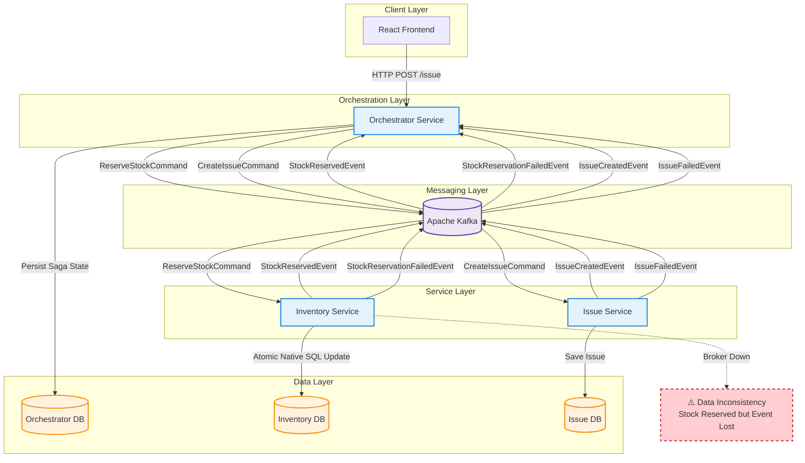

## Failure Scenario: Broker Down after Stock Reservation
If the **Message Broker (Kafka)** is down when the `StockReservedEvent` is fired:

1.  **State**: The `Inventory Service` has successfully committed the stock reservation to `Inventory DB`.
2.  **Failure**: The attempt to publish `StockReservedEvent` to Kafka fails (Connection Refused / Timeout).
3.  **Result**:
    *   The Java process catches the exception.
    *   The `ReserveStockCommand` message processing fails.
    *   **Risk**: If the consumer retries the message without idempotency checks, the stock might be deducted *again* (Double Booking).
    *   **Inconsistency**: The Orchestrator stays waiting for a response, while the stock is physically reserved.
