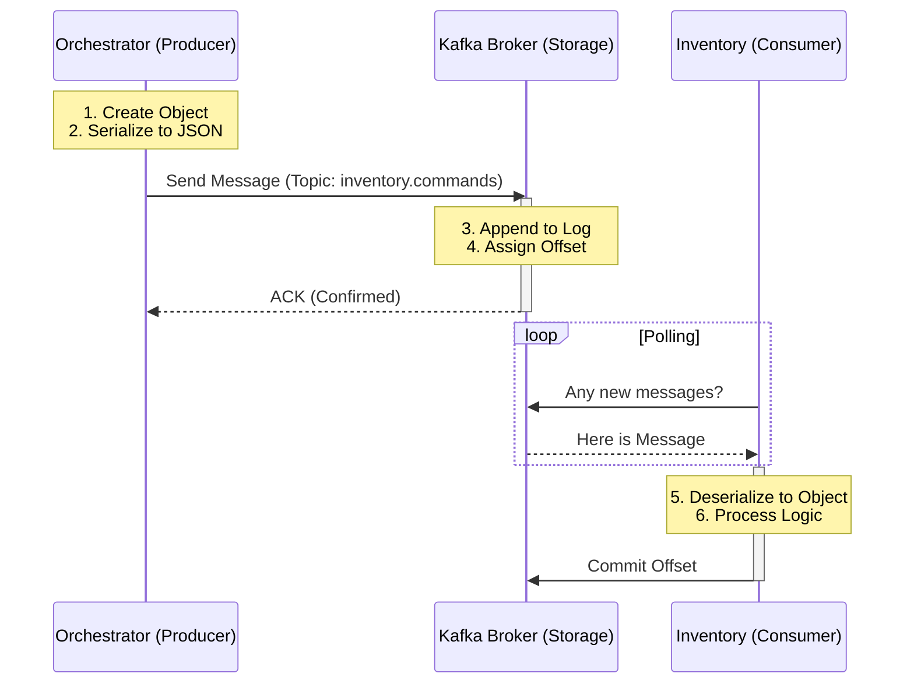

# Kafka Message Flow: From Producer to Consumer

This document explains exactly how a message travels from your `orchestrator-service` to your `inventory-service` based on your current codebase.

## 1. Production (The "Write")
**Who:** `orchestrator-service` -> `KafkaProducerService.java`

When the Orchestrator needs to reserve stock, it creates a `ReserveStockCommand` object and calls the producer service:

```java
// KafkaProducerService.java
public void sendMessage(String topic, String key, Object message) {
    // 1. SERIALIZATION
    // Spring Boot uses the configured Serializer (likely JsonSerializer)
    // to convert your Java Object (message) into a JSON byte array.
    
    // 2. SENDING (Synchronous)
    // .get() blocks this thread until the Broker provides an acknowledgement (ACK).
    kafkaTemplate.send(topic, key, message).get(); 
}
```
-   **Serialized:** The Java Object is turned into bytes (JSON).
-   **Stored:** It is sent over the network to the Kafka Broker.

---

## 2. Storage (The "Broker")
**Where:** The Kafka Server (Broker) on `localhost:9092`.

Once the Broker receives the message:
1.  **Topic & Partition:** It identifies the topic (e.g., `inventory.commands`). It appends the message to the "Log" of a specific partition.
2.  **Persistence:** The message is written to the disk (file system) of the server. It is now "safe".
3.  **Offset:** The message is assigned a unique ID called an **Offset** (e.g., Message #42).

---

## 3. Consumption (The "Read")
**Who:** `inventory-service` -> `InventoryKafkaConsumer.java`

The `inventory-service` is constantly "polling" (asking) the broker for new messages.

```java
// InventoryKafkaConsumer.java
@KafkaListener(topics = TOPIC_INVENTORY_COMMANDS, groupId = GROUP_ID_INVENTORY)
public void consume(ConsumerRecord<?, ?> record) {
    // 1. FETCH
    // The listener retrieves the raw bytes from the topic.

    // 2. DESERIALIZATION
    // The configured JsonDeserializer converts the JSON bytes back into a Java Object
    // (e.g., ReserveStockCommand).
    Object message = record.value();

    // 3. PROCESSING
    if (message instanceof ReserveStockCommand) {
        handleReserve((ReserveStockCommand) message);
    }
    
    // 4. COMMIT
    // Since your code didn't throw an exception, Spring assumes success 
    // and tells the Broker: "I have finished Message #42".
    // The consumer's "Current Offset" moves to 43.
}
```

### Summary Visual

