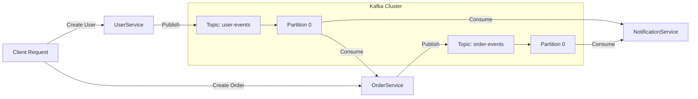

# Mastering Advanced Microservices

A monorepo containing multiple independent Spring Boot microservices demonstrating a microservices architecture with advanced Kafka patterns.

## Services Overview

- **`user-service`**: User management. **(Kafka Producer)** - Publishes to `user-events`.
- **`order-service`**: Order management. **(Kafka Consumer)** - Consumes `user-events` (Partition 0). **(Kafka Producer)** - Publishes to `order-events`.
- **`notification-service`**: Notification system. **(Kafka Consumer)** - Consumes `user-events` (Partition 0) and `order-events` (Partition 0).

---

## 🚀 Kafka Implementation Details

This project demonstrates a **Default Partitioning** pattern using Spring Kafka.

### Architecture



### Configuration

1.  **Topics**:
    -   `user-events`: Default partitions.
    -   `order-events`: Default configuration.
    -   `notification-events`: Default configuration.

2.  **Producers**:
    -   **`user-service`**: Publishes to `user-events`.
    -   **`order-service`**: Publishes to `order-events`.
    -   **`notification-service`**: Publishes to `notification-events`.

3.  **Consumers**:
    -   **`order-service`**: Explicitly listens to `user-events` **Partition 0**.
    -   **`notification-service`**:
        -   Explicitly listens to `user-events` **Partition 0**.
        -   Explicitly listens to `order-events` **Partition 0**.

---

## 🛠️ Build & Run Steps

### 1. Prerequisites
- Java 21
- Maven
- Docker (for Kafka/Zookeeper)

### 2. Start Infrastructure
Ensure Kafka and Zookeeper are running (e.g., via Docker Compose).

### 3. Build & Run Services
Open separate terminals for each service:

**User Service**
```bash
cd user-service && mvn clean install -DskipTests && mvn spring-boot:run
```

**Order Service**
```bash
cd order-service && mvn clean install -DskipTests && mvn spring-boot:run
```

**Notification Service**
```bash
cd notification-service && mvn clean install -DskipTests && mvn spring-boot:run
```

---

## ✅ Verification Steps

### Test User Creation Flow
Send a request to create a user.

```bash
curl -X POST -H "Content-Type: text/plain" -d "User Data" "http://localhost:8082/user/create"
```

**Expected Result:**
1.  **User Service**: Logs "User created event sent".
2.  **Order Service**: Logs "Order Service Received User Event from Partition 0".
3.  **Notification Service**: Logs "Notification Service Received User Event from Partition 0".

### Test Order Creation Flow
Send a request to create an order.

```bash
curl -X POST -H "Content-Type: text/plain" -d "Order Data" "http://localhost:8083/order/create"
```

**Expected Result:**
1.  **Order Service**: Logs "Order created event sent".
2.  **Notification Service**: Logs "Notification Service Received Order Event from Partition 0".
