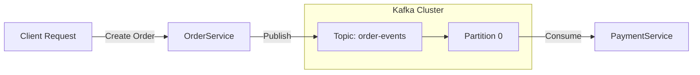

# Mastering Advanced Microservices

A monorepo containing multiple independent Spring Boot microservices demonstrating a microservices architecture with advanced Kafka patterns.

## Services Overview

- **`order-service`**: Order management. **(Kafka Producer)** - Publishes to `order-events`.
- **`payment-service`**: Payment processing. **(Kafka Consumer)** - Consumes `order-events` (Partition 0) to process payments.

---

## 🚀 Kafka Implementation Details

This project demonstrates a **Default Partitioning** pattern using Spring Kafka.

### Architecture



### Configuration

1.  **Topics**:
    -   `order-events`: Default configuration.
    -   `payment-events`: Default configuration.

2.  **Producers**:
    -   **`order-service`**: Publishes to `order-events`.
    -   **(Removed) `user-service`**: Previously published to `user-events`. Service removed.

3.  **Consumers**:
    -   **`payment-service`**:
        -   Explicitly listens to `order-events`.
        -   (Legacy) Listens to `user-events` (Service removed).

---

## 🛠️ Build & Run Steps

### 1. Prerequisites
- Java 21
- Maven
- Docker (for Kafka/Zookeeper/Postgres)

### 2. Start Infrastructure
Ensure Kafka, Zookeeper and Postgres are running.

### 3. Build & Run Services
Open separate terminals for each service:

**Order Service**
```bash
cd order-service && mvn clean install -DskipTests && mvn spring-boot:run
```

**Payment Service**
```bash
cd payment-service && mvn clean install -DskipTests && mvn spring-boot:run
```

---

## ✅ Verification Steps

### Test Order Creation Flow
Send a request to create an order.

```bash
curl -X POST -H "Content-Type: text/plain" -d "Order Data" "http://localhost:8083/order/create"
```

**Expected Result:**
1.  **Order Service**: Logs "Order created event sent".
2.  **Payment Service**: Logs "Payment Service Received Order Event..." and saves to DB.
