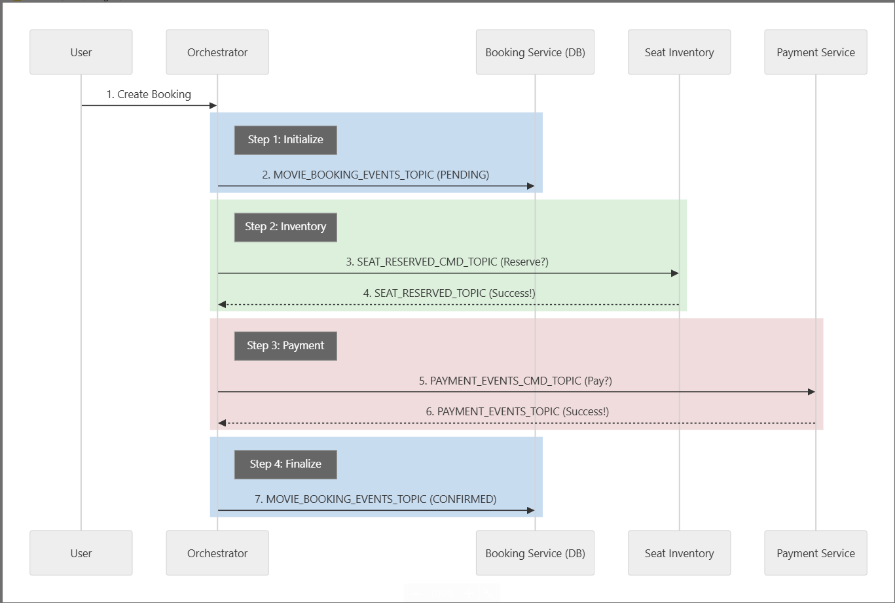

# Mastering Advanced Microservices (MAMS) - Saga Orchestration

A multi-module Maven project demonstrating the **Saga Orchestration Pattern** for distributed transactions using Spring Boot, Spring Cloud Stream, and Kafka.

## 🚀 Service Architecture & Ports


| Service | Port | Description |
| :--- | :--- | :--- |
| **Booking Orchestrator** | 8084 | **Initiator/Coordinator**. Handles Booking Request and coordinates the Saga. |
| **Booking Service** | 8081 | **Data Store**. Persists Booking state based on Orchestrator events. |
| **Seat Inventory Service** | 8082 | **Participant**. Lock/Release seats based on commands. |
| **Payment Service** | 8083 | **Participant**. Process payments based on commands. |
| **Kafka** | 9092 | Message Broker |
| **Postgres** | 5432 | Database (Shared for demo: `booking_database`) |

## 🏗️ Build & Run

### Prerequisites
- Java 17
- Maven
- PostgreSQL (Port 5432, user: `postgres`, pass: `1234`)

### Steps
1.  **Start Infrastructure**:
    Run the provided script to build projects and start Kafka, Zookeeper, and all Microservices.
    ```powershell
    run_all_with_kafka.bat
    ```

## 🛠️ API Documentation

### **1. Booking Orchestrator** (Port 8084)
**Create Booking (Saga Start)**
- **Endpoint**: `POST /orchestrator/booking`
- **Description**: Entry point for the Saga. Coordinates Inventory and Payment.
- **Request**:
  ```json
  {
    "userId": "101",
    "showId": "101",
    "seatIds": ["1", "2"],
    "amount": 100
  }
  ```
- **Response**: `200 OK` with Status `PENDING` (Final status processed asynchronously).

### **2. Booking Service** (Port 8081)
Read-only view of bookings (updates handled via Kafka).

- **Get Booking Status**: `GET /bookings/{bookingId}`
- **Get All Bookings**: `GET /bookings`

### **3. Seat Inventory Service** (Port 8082)
Manages seat inventory. Listens to `seat-reserved-commands`.

### **4. Payment Service** (Port 8083)
Manages balances. Listens to `booking-payment-commands`.

## 🔄 Saga Flow (Orchestration)




The **Booking Orchestrator** centralizes the decision-making process.

1.  **User** -> **Orchestrator**: `POST /booking`.
2.  **Orchestrator**:
    - Generates Booking ID.
    - Emits `BookingCreatedEvent` (PENDING) -> **Booking Service** saves state.
    - Sends `SeatReservedEvent` (Command) -> **Inventory Service**.
3.  **Inventory Service**:
    - Locks seats.
    - Replies `SeatReservedEvent` (Success/Fail) -> **Orchestrator**.
4.  **Orchestrator**:
    - If Inventory Success: Sends `BookingPaymentEvent` (Command) -> **Payment Service**.
    - If Inventory Fail: Mark Booking FAILED.
5.  **Payment Service**:
    - Deducts balance.
    - Replies `BookingPaymentEvent` (Success/Fail) -> **Orchestrator**.
6.  **Orchestrator**:
    - If Payment Success: Mark Booking CONFIRMED.
    - If Payment Fail: Send Rollback Command to Inventory & Mark Booking FAILED.

### 🧩 Deep Dive: Topics & Commands

- **Commands**:
    - `seat-reserved-commands`: Orchestrator -> Inventory
    - `booking-payment-commands`: Orchestrator -> Payment
- **Replies/Events**:
    - `seat-reserved-events`: Inventory -> Orchestrator
    - `booking-payment-events`: Payment -> Orchestrator
    - `booking-created-events`: Orchestrator -> Booking Service (State Persistence)

## 🧪 Testing Scenarios

1.  **Happy Path**: User with sufficient balance books available seats. -> **CONFIRMED**.
2.  **Insufficient Funds**: Payment fails -> Orchestrator sends Rollback to Inventory -> **FAILED**.
3.  **Seat Unavailable**: Inventory fails -> Orchestrator marks **FAILED**.